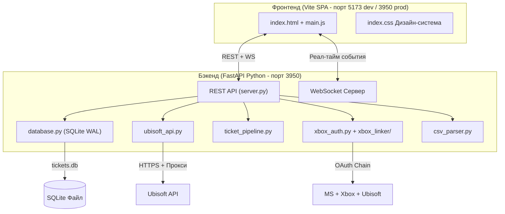

# Ubisoft Ticket Manager - Полный Статус Проекта

> **Обновлено:** 21 июля 2026  
> **Стек:** Vite + Vanilla JS фронтенд, **FastAPI + SQLite** бэкенд (Python), WebSocket для реал-тайма

---

## Архитектура



---

## Структура файлов

| Файл | Размер | Назначение |
|------|--------|-----------|
| [package.json](file:///home/caterinw/Downloads/Project%20Files/ticket-manager/package.json) | 833B | Зависимости фронтенда и скрипты |
| [vite.config.js](file:///home/caterinw/Downloads/Project%20Files/ticket-manager/vite.config.js) | 377B | Дев-сервер + прокси конфиг |
| **Python Бэкенд** | | |
| [server.py](file:///home/caterinw/Downloads/Project%20Files/ticket-manager/backend/server.py) | 10.5KB | FastAPI роуты, WS, раздача фронтенда |
| [database.py](file:///home/caterinw/Downloads/Project%20Files/ticket-manager/backend/database.py) | 13.2KB | SQLite схема (WAL), все CRUD операции |
| [ubisoft_api.py](file:///home/caterinw/Downloads/Project%20Files/ticket-manager/backend/ubisoft_api.py) | 12.7KB | Авторизация, рефреш, Session Elevation, тикеты, Capsolver |
| [ticket_pipeline.py](file:///home/caterinw/Downloads/Project%20Files/ticket-manager/backend/ticket_pipeline.py) | 20.6KB | Полный пайплайн: auth->elevate->captcha->ticket + мониторинг |
| [xbox_auth.py](file:///home/caterinw/Downloads/Project%20Files/ticket-manager/backend/xbox_auth.py) | 4.0KB | Обёртка Xbox OAuth (MS->Xbox->Ubisoft) |
| [csv_parser.py](file:///home/caterinw/Downloads/Project%20Files/ticket-manager/backend/csv_parser.py) | 3.2KB | Парсинг Xbox/PSN CSV форматов |
| [requirements.txt](file:///home/caterinw/Downloads/Project%20Files/ticket-manager/backend/requirements.txt) | 105B | Python зависимости |
| **Xbox Linker (Python)** | | |
| [ms_auth.py](file:///home/caterinw/Downloads/Project%20Files/ticket-manager/backend/xbox_linker/ms_auth.py) | 51.8KB | Microsoft OAuth + IMAP OTP |
| [xbox_profile.py](file:///home/caterinw/Downloads/Project%20Files/ticket-manager/backend/xbox_linker/xbox_profile.py) | 13.0KB | Xbox Live профиль и XSTS токены |
| [ubisoft_exchange.py](file:///home/caterinw/Downloads/Project%20Files/ticket-manager/backend/xbox_linker/ubisoft_exchange.py) | 7.5KB | Обмен Xbox токена на Ubisoft |
| [imap_helper.py](file:///home/caterinw/Downloads/Project%20Files/ticket-manager/backend/xbox_linker/imap_helper.py) | 14.0KB | IMAP верификация OTP кодов |
| **JS Legacy (сохранено как reference)** | | |
| [server/index.js](file:///home/caterinw/Downloads/Project%20Files/ticket-manager/server/index.js) | 23.3KB | Старый Express сервер |
| **Фронтенд** | | |
| [index.html](file:///home/caterinw/Downloads/Project%20Files/ticket-manager/src/index.html) | 5.8KB | SPA-оболочка с сайдбаром |
| [main.js](file:///home/caterinw/Downloads/Project%20Files/ticket-manager/src/main.js) | 114KB | Все страницы, WS обработчик, глобальные действия |
| [index.css](file:///home/caterinw/Downloads/Project%20Files/ticket-manager/src/styles/index.css) | 42KB | Полная тёмная тема с дизайн-системой |

---

## ✅ Что Сделано

### 1. GUI - Веб SPA
- ✅ Тёмная тема (Vite + Express, шрифт Inter, дизайн-система)
- ✅ Навигация: Дашборд, Тикеты, Аккаунты, Импорт CSV, Статистика, Неудачные, Настройки
- ✅ Система тостов (успех, ошибка, предупреждение, инфо)
- ✅ Статус WebSocket-подключения в футере сайдбара
- ✅ Модальные окна (для ручного ввода JSON авторизации)

### 2. SQLite База Данных (реал-тайм)
- ✅ `better-sqlite3` с **WAL режимом** - крашбезопасная запись
- ✅ 5 таблиц: `accounts`, `tickets`, `messages`, `failed_accounts`, `settings`
- ✅ Foreign keys, индексы на всех полях запросов
- ✅ Все записи синхронные - каждый INSERT/UPDATE сразу на диск
- ✅ БД создаётся автоматически при первом запуске

### 3. Удаление данных
- ✅ Удаление отдельных тикетов и аккаунтов (CASCADE на связанные данные)
- ✅ Массовое удаление тикетов по фильтру (платформа/статус)
- ✅ Удаление неудачных аккаунтов
- ✅ Подтверждение на все деструктивные действия

### 4. Статистика по неделям / Бар-чарт
- ✅ Запрос завершённых тикетов по `week_number`, `year`, `platform`
- ✅ Неделя начинается с воскресенья
- ✅ Canvas бар-чарт (Xbox зелёный, PSN синий, стекед)
- ✅ Фильтры по месяцу и году

### 5. Фильтрация тикетов
- ✅ По платформе (XBL / PSN)
- ✅ По статусу (Open, Awaiting Reply, Awaiting Response, Completed)
- ✅ По дате открытия
- ✅ Все три фильтра комбинируются в SQL-запросе
- ✅ Цветные бейджи для платформ и статусов

### 6. Чат-интерфейс тикетов
- ✅ Бабблы: агент (слева, тёмный фон), пользователь (справа, синий оттенок)
- ✅ Авто-скролл вниз при открытии
- ✅ Enter для отправки, Shift+Enter для новой строки
- ✅ Боковая панель: инфо об аккаунте (юзернейм, уровень, платформа, емейлы, дата привязки)
- ✅ **Заметки** (textarea + кнопка сохранения) - сохраняются в `tickets.notes`
- ✅ **Close Ticket** - закрывает через API + помечает Completed
- ✅ **Regenerate Ticket** - закрывает текущий + создаёт новый
- ✅ **Refresh** - принудительный опрос Ubisoft API
- ✅ Ответы отправляются через API И сохраняются локально
- ✅ Кнопки CamoFox в сайдбаре чата (PSN/Xbox)

### 7. CamoFox Браузер
- ✅ PSN: открывает `https://my.account.sony.com/central/signin` с прокси
- ✅ Xbox (опционально): открывает `https://login.live.com/` с прокси
- ✅ `detached: true` - браузер живёт отдельно от сервера
- ✅ Трекинг активных браузеров, защита от дублей

### 8. Уведомления
- ✅ WebSocket реал-тайм события
- ✅ Тосты для всех действий
- ✅ Browser Notifications API (push) при ответе агента
- ✅ Звук (Web Audio API) при новом сообщении агента

### 9. Токены Ubisoft
- ✅ Логин через Basic Auth, до 3 попыток с паузами
- ✅ Рефреш через существующий токен
- ✅ Автоцикл каждые 50 мин, обновляет за 15 мин до истечения
- ✅ При невалидном токене -> `manual_login_required` + уведомление
- ✅ Ручной рефреш через кнопку

### 10. Импорт CSV и автологин
- ✅ Загрузка файла (drag-drop + browse) и вставка текста
- ✅ Оба формата: Xbox (7 колонок) и PSN (8 колонок)
- ✅ Смешанные файлы - определение по полю `Platform Linked`
- ✅ Автоматический логин после импорта (3 попытки, 1.5с пауза)
- ✅ Провал -> `manual_login_required` + кнопки "Manual Auth" и "Retry"
- ✅ Ошибки парсинга -> `failed_accounts`

### 11. Ручная авторизация
- ✅ Модалка для вставки JSON словаря
- ✅ Валидация полей: `ticket`, `profileId`, `sessionId`
- ✅ Секция неудачных аккаунтов с общим счётчиком и бейджем

### 12. Создание тикетов
- ✅ Капча через 2Captcha (reCAPTCHA v3 Enterprise, поллинг до 120 сек)
- ✅ Создание через `POST account-recovery-cases`
- ✅ Извлечение номера кейса из ответа (`"...|26358701"` -> `"26358701"`)
- ✅ Контактный email = email платформенного логина

### 13. Мониторинг тикетов
- ✅ Автоопрос каждые 45 сек (настраивается)
- ✅ Маппинг: `Waiting->Awaiting Reply`, `Updated->Awaiting Response`, `Closed->Completed`
- ✅ Новые сообщения агента -> уведомление (тост + push + звук)

### 14. Интеграция AI
- ✅ Модель DeepSeek V3 (китайская)
- ✅ Системный промпт: владелец аккаунта, потерял доступ к платформе
- ✅ Полная история чата передаётся как контекст
- ✅ **НЕ авто-отправляет** - требует подтверждения пользователя
- ✅ Кнопки: Принять, Редактировать, Регенерировать, Отклонить

### 15. Настройки
- ✅ Прокси (US и Global), ключ 2Captcha, интервалы, AI ключ + модель, путь CamoFox

### 16. Дашборд
- ✅ 11 карточек статистики с цветовой кодировкой
- ✅ Бейджи в сайдбаре (Awaiting Reply, Failed)

---

## ⚠️ Известные Проблемы

### Исправлено сегодня (17 июля 2026)

1. ~~**`updateTicketStatus()` дублированный if-блок**~~ -> **ИСПРАВЛЕНО** (database.js)
2. ~~**Нет process-level error handlers**~~ -> **ИСПРАВЛЕНО** (`uncaughtException` + `unhandledRejection` в index.js)
3. ~~**broadcast() мог крашнуть при битом WS-клиенте**~~ -> **ИСПРАВЛЕНО** (try-catch на каждый клиент)
4. ~~**isRefreshing/isMonitoring могли залочиться навсегда**~~ -> **ИСПРАВЛЕНО** (try-finally в обоих менеджерах)
5. ~~**Капча не работала - 2captcha.com заблокирован**~~ -> **ИСПРАВЛЕНО** (captcha-solver теперь ходит через прокси)
6. ~~**Агент закрывает тикет -> у нас Completed**~~ -> **ИСПРАВЛЕНО** (ticket-monitor: при `Closed` от Ubisoft - остаётся `Awaiting Reply` + уведомление)

### Оставшиеся вопросы

1. **CSV парсер наивный** - `split(',')` сломается если пароль содержит запятую
2. **`linkedAccounts` в createTicket пустой** - может потребоваться заполнение данными Xbox/PSN
3. **CamoFox CLI-флаги** - `--proxy`, `--url`, `--no-close` нужно проверить под конкретную версию
4. **PSN автологин** - браузер открывает страницу, но НЕ вводит логин/пароль

---

## ❌ Что НЕ Сделано / Не Соответствует ТЗ

| Пункт | Статус | Подробности |
|-------|--------|------------|
| **UI редизайн** | 🔄 В процессе | Заказчик одобрил текущий, но запросил превью обновлённого дизайна. Ждём референсы |
| **API ключ 2Captcha** | ❌ Невалиден | Ключ `3929d...` возвращает `ERROR_KEY_DOES_NOT_EXIST`. Нужен актуальный ключ от заказчика |
| **AI-провайдер** | ⚠️ Обсуждается | OpenRouter одобрен заказчиком условно. Рекомендуется MixRoute или RockAPI (см. раздел ниже) |
| **PSN автологин в CamoFox** | ❌ Не сделано | Браузер открывает страницу, но не вводит данные. Нужна browser automation |
| **Заметки аккаунтов в UI** | ⚠️ Частично | Поле в БД есть, API есть, но в UI на странице Accounts нет textarea |
| **Чат авто-обновление** | ⚠️ | Если чат открыт и WS событие пришло - чат не рефрешится автоматически |
| **Баланс 2Captcha в UI** | ⚠️ | Роут `/api/captcha/balance` есть, но нигде не отображается в интерфейсе |
| **Список активных браузеров** | ⚠️ | `GET /api/browsers` есть, но нет UI-компонента |
| **Тест полного цикла** | ⏳ Ждёт | Нужен валидный ключ 2Captcha для тестирования создания тикетов |

---

## 🤖 Рекомендации по Замене AI-провайдера

> Текущий провайдер **OpenRouter** - американская компания. Заказчик одобрил условно, но ТЗ требует не-западный. Варианты:

| Провайдер | Плюсы | Минусы | Оплата | Хостинг |
|-----------|-------|--------|--------|--------|
| **MixRoute** | OpenAI-совместимый API, DeepSeek доступен, стабильный | Менее известный | USDT/USDC ✅ | Глобальный |
| **RockAPI** | Специально для RU пользователей, русские карты + крипто | Только для RU региона | USDT + RU карты ✅ | RU |
| **AI/ML API** | Много моделей, pay-as-you-go | Дороже | Крипто ✅ | Глобальный |
| **DeepSeek API напрямую** | Официальный, дешевле всех ($0.27/1M tokens input) | Крипту НЕ принимают, только Alipay/WeChat | ❌ крипто | Китай |
| **OpenRouter (текущий)** | Уже подключён, работает | US компания | Крипто ✅ | США |

**Рекомендация:** Переключиться на **MixRoute** - меняется только `baseUrl` и API ключ в `ai-assistant.js` (строка 6 и 68). Код менять минимально.

```js
// Было:
const OPENROUTER_BASE = 'https://openrouter.ai/api/v1';
// Станет:
const OPENROUTER_BASE = 'https://api.mixroute.ai/v1'; // пример
```

---

## Как Запустить

### Production (рекомендуется - Python бэкенд раздаёт всё)
```bash
cd ticket-manager
pip install -r backend/requirements.txt   # Python зависимости
npm install && npm run build               # Собрать фронтенд в dist/
python -m backend.server                   # Всё на http://localhost:3950
```

### Development (два процесса)
```bash
# Терминал 1 - Бэкенд:
cd ticket-manager
python -m backend.server      # http://localhost:3950

# Терминал 2 - Фронтенд:
cd ticket-manager
npm run dev                   # http://localhost:5173 -> прокси на 3950
```

---

## Справочник API Роутов

| Метод | Роут | Назначение |
|-------|------|-----------|
| GET | `/api/dashboard` | Статистика дашборда |
| GET | `/api/accounts` | Список аккаунтов |
| GET | `/api/accounts/:id` | Детали аккаунта |
| PUT | `/api/accounts/:id/notes` | Обновить заметки аккаунта |
| POST | `/api/accounts/:id/retry-login` | Повторить логин |
| POST | `/api/accounts/:id/manual-auth` | Ручная авторизация JSON |
| POST | `/api/accounts/:id/refresh-token` | Принудительный рефреш токена |
| DELETE | `/api/accounts/:id` | Удалить аккаунт + каскад |
| POST | `/api/accounts/:id/browser/psn` | Запустить PSN CamoFox |
| POST | `/api/accounts/:id/browser/xbox` | Запустить Xbox CamoFox |
| GET | `/api/browsers` | Активные браузеры |
| POST | `/api/import/csv` | Загрузить CSV файл |
| POST | `/api/import/csv-text` | Импорт вставленного CSV текста |
| GET | `/api/tickets` | Список тикетов (фильтры: platform, status, date) |
| GET | `/api/tickets/:id` | Детали тикета |
| PUT | `/api/tickets/:id/status` | Обновить статус тикета |
| PUT | `/api/tickets/:id/notes` | Обновить заметки тикета |
| DELETE | `/api/tickets/:id` | Удалить тикет |
| POST | `/api/tickets/bulk-delete` | Массовое удаление по фильтру |
| POST | `/api/tickets/create/:accountId` | Создать тикет поддержки |
| POST | `/api/tickets/:id/close` | Закрыть тикет в Ubisoft |
| POST | `/api/tickets/:id/regenerate` | Закрыть + создать новый |
| POST | `/api/tickets/:id/reply` | Отправить ответ в Ubisoft |
| POST | `/api/tickets/:id/poll` | Принудительный опрос обновлений |
| POST | `/api/tickets/:id/suggest` | Получить AI подсказку |
| GET | `/api/tickets/:id/messages` | Сообщения чата |
| GET | `/api/stats/weekly` | Еженедельная статистика |
| GET | `/api/failed-accounts` | Неудачные аккаунты + счётчик |
| DELETE | `/api/failed-accounts/:id` | Удалить неудачный аккаунт |
| GET | `/api/captcha/balance` | Баланс 2Captcha |
| GET | `/api/settings` | Все настройки |
| PUT | `/api/settings` | Обновить настройку (key/value) |

---

## Итог

Проект **полностью мигрирован на Python (FastAPI)**. Бэкенд запускается одной командой `python -m backend.server` и раздаёт скомпилированный фронтенд. Все ключевые функции из ТЗ реализованы. Token Manager и Ticket Monitor работают как фоновые async задачи. Xbox OAuth flow портирован полностью из рабочего проекта.
