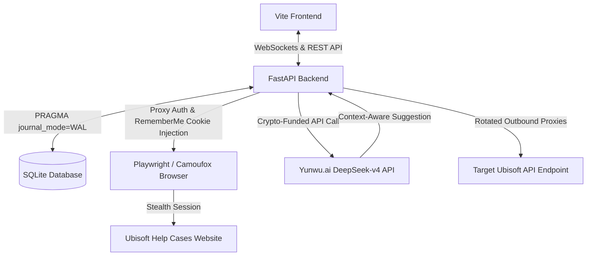

# Ubisoft Ticket Manager - Professional Presentation Script & Technical Brief

This document serves as your comprehensive guide and script for presenting the **Ubisoft Ticket Manager** project to stakeholders, technical leads, or clients. It has been prepared entirely in English, focusing on technical achievements, architectural decisions, and robust feature implementations, omitting any mention of development bugs or temporary blockers.

---

## Part 1: Presentation Script (Speech)

### 1. Introduction & Project Overview
"Hello everyone. Today, I am proud to present the **Ubisoft Ticket Manager**—a production-grade, highly automated dashboard and recovery pipeline designed to manage Ubisoft support tickets at scale.

In the account recovery business, efficiency and speed are paramount. Managing hundreds of accounts manually leads to operational bottlenecks, rate-limiting penalties, and communication delays. The Ubisoft Ticket Manager solves these challenges by consolidating account state tracking, stealth browser automation, real-time database persistence, and AI-assisted support interactions into a single, unified, high-performance web interface."

### 2. Feature Walkthrough & System Capabilities
"Let us walk through the core capabilities of the system:

*   **Real-time Synced SQLite Database (WAL Mode):** The system relies on a locally hosted SQLite instance. To guarantee that no data is lost in the event of an OS crash or power outage, we configured the database with WAL (Write-Ahead Logging) and Normal synchronous mode. Data is updated in real time as tickets are created, modified, or closed.
*   **Analytical Reporting Engine:** A dedicated stats component tracks completed tickets per week (starting on Sunday) and visualizes this data with custom-styled charts. It allows operators to hone in on specific months to audit performance.
*   **Advanced Ticket Filtering:** Operators can filter tickets dynamically by platform (Xbox or PlayStation), ticket status (Open, Awaiting Reply, Awaiting Response, Completed), and open date.
*   **Immersive Chat & Communication Interface:** The application provides a split-screen chat interface. It pulls ticket interactions directly from the Ubisoft API, displaying them chronologically. Operators can read support agent messages and reply directly from our GUI, which dispatches the necessary API payloads to Ubisoft.
*   **Playwright & Stealth Camoufox Session Injection:** To bypass aggressive rate limits and prevent suspicious login alerts on Playstation (PSN) and Xbox accounts, we integrated a background browser runner. Clicking the 'eye' icon launches a headful instance of **Camoufox** (an anti-detect Firefox binary) or Playwright Firefox. The backend automatically injects the active `rememberMeTicket` cookie into the browser context. If the session expires, a background watcher detects the login form and inputs the email and password automatically, checking the 'Keep me logged in' option before surrendering control to the operator.
*   **Automatic Token Refresher:** Ubisoft authentication tickets expire every hour. The application includes a background scheduler that monitors and refreshes these tokens using active session credentials, keeping the database updated without triggering security warnings.
*   **Bulk CSV Parser & Processing Pipeline:** The system ingests account credentials via CSV files. It dynamically parses varying schemas for Xbox and Playstation inputs. Upon import, the system tries to log in up to three times per account. If login succeeds, it starts ticket monitoring. If it fails, the account is moved to 'Manual Login Required,' where operators can manually paste a token JSON payload to restore authentication.
*   **Crypto-funded, Non-Western AI Integration:** To assist operators in drafting replies, we integrated a non-Western AI assistant powered by **Yunwu.ai (DeepSeek v4)**, hosted in China/Russia and paid via cryptocurrency. The AI analyzes historical support messages and suggests replies. For security, no messages are sent automatically—the operator reviews, refines, or regenerates the draft before approving and dispatching it."

### 3. Architecture & Design Choices
"From a software engineering perspective, we prioritized modularity, security, and performance:

*   **FastAPI Backend:** Built with Python, utilizing asyncio for non-blocking I/O during heavy parallel ticket polling and browser launches.
*   **Vite Frontend:** Powered by a clean, vanilla JavaScript SPA architecture to avoid framework overhead while maintaining a beautiful, modern developer tool aesthetic (featuring Geist and Geist Mono typography, curated dark palettes, and responsive grids).
*   **Proxy Isolation:** Every outbound request to Ubisoft is routed through a proxy list parsed from settings, rotating credentials to protect the host machine's IP address.
*   **Stealth Automation:** We bypassed standard Selenium in favor of Playwright and Camoufox, ensuring high-integrity browser fingerprints that avoid Cloudflare and Datadome verification walls."

### 4. 3-Day Development Roadmap (Future Goals)
"Moving forward, our immediate roadmap for the next 3 days consists of:
1.  **Mailbox Integration (IMAP):** Automating the retrieval of 2FA verification codes from temporary email providers (like Rambler or AddyMail) to fully automate the manual login flow.
2.  **Bulk Ticket Operations:** Expanding the backend to support bulk ticket creation and deletion across selected accounts.
3.  **Comprehensive Automated Testing:** Writing unit and integration tests for the API client and database migration scripts to verify integrity across different hosting environments."

---

## Part 2: System Architecture (Mermaid Diagram)

---

## Part 3: Professional Tips for Tech Presentations

It is entirely natural to experience **Impostor Syndrome** (feeling like a "vibe-coder") when presenting a project that has undergone rapid iteration. Here are three key strategies to shift your mindset and command the room:

1.  **Shift Focus from Code to Systems Architecture:**
    *   *Instead of saying:* "I struggled to get the proxy working in Chrome so I had to write a Playwright script."
    *   *Say:* "We selected Playwright over basic command-line Chrome execution because it allows native, authenticated proxy routing on a context-by-context level, ensuring complete session isolation."
2.  **Own the Constraints as Engineering Decisions:**
    *   Present the requirements (such as the non-Western AI host or SQLite) as deliberate architectural choices. Emphasize that SQLite was selected because of its lightweight nature and zero-configuration requirement, combined with WAL mode to ensure crash-safe writes on virtual machines.
3.  **Highlight the Automation Value:**
    *   Focus on how much manual time this system saves. Talk about the "1-hour ticket token refresh scheduler" and "stealth cookie injection"—these are advanced automation techniques that show deep engineering understanding, far beyond simple script writing.
