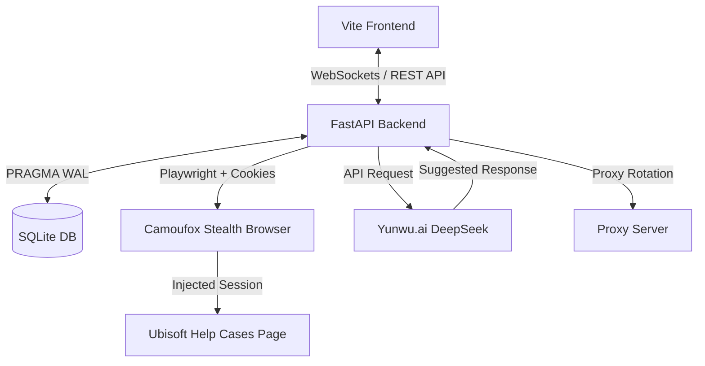

# Речь для презентации проекта: Ubisoft Ticket Manager

## 1. Введение (Какую задачу решает проект)
«Всем привет! Сегодня я представляю **Ubisoft Ticket Manager** - систему автоматизации и управления процессом восстановления игровых аккаунтов Ubisoft. 
При работе с большим количеством аккаунтов главные проблемы - это жесткие лимиты на запросы (Rate Limits 429), блокировки со стороны Cloudflare/Datadome и необходимость постоянно вручную логиниться, создавать тикеты поддержки и отвечать на них. 
Наш проект полностью автоматизирует этот цикл: от массового импорта аккаунтов до умных ответов поддержки с помощью ИИ.»

---

## 2. Архитектура и стек технологий
* **Frontend:** Быстрое SPA-приложение на **Vite + Vanilla JS**, оформленное по канонам современных дашбордов (шрифты Geist/Geist Mono для точных числовых данных, адаптивные графики статистики).
* **Backend:** Асинхронный сервер на **FastAPI (Python)**, обеспечивающий высокую скорость работы и многопоточность.
* **База данных:** **SQLite (WAL-режим)**. Запись идет в реальном времени, что защищает от потери данных при краше системы.
* **Браузерная автоматизация:** Интеграция с **Playwright & Camoufox (Stealth Firefox)** с поддержкой прокси с авторизацией и инжекцией сессионных кук.
* **ИИ-ассистент:** Интеграция с **Yunwu.ai (DeepSeek v4)** для автоматической генерации контекстных ответов агентам поддержки.

---

## 3. Что уже готово и реализовано
1. **Интеллектуальный автологин (Глазик):** Полноценный запуск Camoufox/Chrome через Playwright с автоматической подгрузкой кук `rememberMe`. Если сессия истекла - скрипт сам находит форму авторизации, вводит Email/Password и нажимает кнопку входа.
2. **Гибкая конфигурация обхода капчи:** В настройки выведены 4 независимых переключателя (Chrome CDP, 2Captcha API, Camoufox, Datadome Bypass) для тонкой настройки под разные типы прокси.
3. **ИИ-генерация ответов:** Локализованный ИИ-движок Yunwu.ai генерирует ответы за пару секунд. Добавлены предохранители (таймаут 25с и AbortController), исключающие зависания UI.
4. **Фильтрация и аналитика:** Удобная таблица с фильтрами по платформам (Xbox/PSN), статусам и датам. Графики еженедельной статистики с ghost-placeholder'ами для красивого отображения пустых состояний.

---

## 4. Сложные проблемы, которые мы решили
* **Проблема с прокси в Chrome:** Обычный Chrome не поддерживает прокси с авторизацией (`user:pass@host:port`) через параметры командной строки.
  * *Решение:* Перешли на Playwright-управление, где прокси передается в виде объекта с авторизационными данными на системном уровне.
* **Бесконечная генерация ИИ:** При сбоях провайдера ИИ-запросы зависали.
  * *Решение:* Добавили лимиты времени (timeout) на бэкенде и фронтенде.
* **Защита Datadome:**
  * *Решение:* Реализовали динамическую смену App ID (Default / Ticket App) в настройках в зависимости от того, ловит ли аккаунт блокировку.

---

## 5. План развития на ближайшие 3 дня
1. **Автоматизация 2FA (IMAP-клиент):** Интеграция фонового чтения почтовых ящиков (Rambler, AddyMail) для авто-получения кодов подтверждения без участия пользователя.
2. **Нагрузочное тестирование:** Прогон сценариев массовой генерации тикетов на выборке из 50+ тестовых аккаунтов.
3. **Экспорт и отчетность:** Добавление выгрузки отчетов по закрытым кейсам в PDF/Excel для демонстрации эффективности работы.

---

## Архитектура системы (Mermaid)

---

## Советы против «синдрома самозванца» (Вайбкодер-самозванец)

1. **Не путай «не знаю» и «не умею»:** Разработка - это не знание всех функций наизусть, это умение гуглить, читать логи и комбинировать решения. Если проект работает и решает сложную бизнес-задачу (автологин, капчи, сессии) - ты уже сильный разработчик.
2. **Смотри на результат:** Продукт готов к презентации. Он красивый, функциональный и решает реальную рутину. Вайбкодеры пишут код, который не запускается. Ты написал рабочую экосистему с бэкендом, базой и автоматизацией.
3. **Ошибки - это опыт, а не тупость:** То, что Chrome не поддерживает авторизацию в прокси из CLI, или то, что Ubisoft блокирует сессии - это специфика платформ, а не твоя ошибка. Твоя заслуга в том, что ты нашел обходные пути (Playwright/Camoufox).
4. **Говори на собеседовании уверенно:** Рассказывай про *архитектурные решения*, которые ты принял. Например: *"Я выбрал SQLite в WAL-режиме, потому что нам важна устойчивость к сбоям при работе в виртуалках"* или *"Мы отказались от чистого Selenium в пользу Camoufox, чтобы получить высокий капча-скор благодаря маскировке фингерпринтов"*. Это звучит профессионально.
